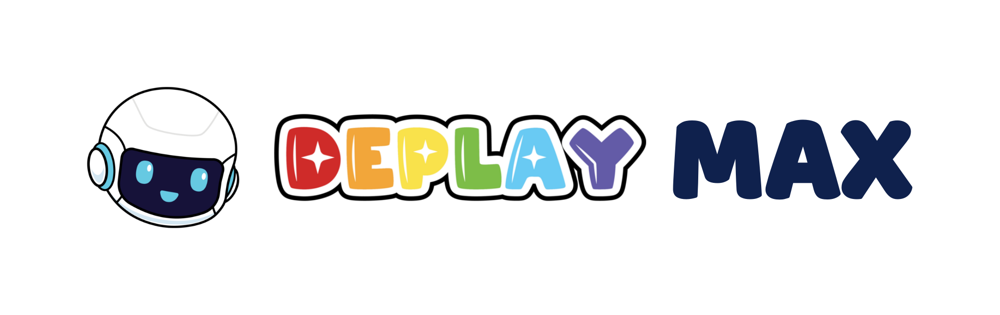

<picture>
  <source media="(prefers-color-scheme: dark)" srcset="brand/deplay-max-lockup-geel-op-navy.svg">
  
</picture>

# DEPLAY MAX — releases for partner studios

**[DEPLAY](https://deplay.nl)** is a Dutch children's brand, best known for its kids' tablet and smartwatch.
**[DEPLAY MAX](https://deplaymax.com)** is the subscription DEPLAY sells to parents: one payment a month, and the
family gets the apps of several studios — yours among them — instead of buying each one separately.

Your side of it is one question, asked while your app runs: *does this family's subscription unlock me?* Yes, and
you unlock. No, or no answer at all, and your own access decides. You never see the payment, the plan or the
parent's account; DEPLAY MAX handles all of that and answers you yes or no, nothing else.

Your app still ships to the ordinary stores and runs wherever people install it. On a device without DEPLAY MAX the
question answers "not installed" in milliseconds and costs you nothing, so there is one build, not two.

**This repository is how you get what you need to ask that question:** an Android library, a build of DEPLAY MAX to
test against, working example projects for each way of asking, and one README that explains all of it. It is
private, and DEPLAY invites your studio by GitHub username.

Everything ships as a **release**. Take the newest one: [**Releases →**](https://github.com/DEPLAY-SOFTWARE-BV/deplay-max-releases/releases).

## Start here: what are you building?

| You are building | Download from the release | Read, in the release's `README.md` |
| --- | --- | --- |
| A native Android app (Kotlin or Java) that checks on the device | `deplay-max-sdk-<version>.aar` | *The SDK in five minutes*, then *Integrating the SDK* |
| A Unity game | `deplay-max-unity-<version>.tgz` | *The Unity package*, then *The SDK in five minutes* |
| A Flutter app | `deplay-max-sdk-<version>.aar`, and `deplay-max-examples-<version>.tar.gz` → `route3-flutter` | *Flutter*, then *The SDK in five minutes* |
| A backend that asks about a parent by e-mail address | `deplay-max-examples-<version>.tar.gz` → `route2-server` | that client's own README: it is the request, the answer, the error slugs and the cache in one place |
| A backend that verifies a signed token your app received | `deplay-max-examples-<version>.tar.gz` → `route3-verify-node` | *Route 3: a token for your own server* and *Verifying a route 3 token* |
| Trying it out before you write code | `deplay-max-<version>-sandbox-debug.apk` | *Download*, and the sandbox notes in the release description |

Unsure which route is yours? One line each — and where this page says *we* or *our*, that is DEPLAY MAX's side
of the line: the app on the device and the backend behind it.

1. **On the device.** Your app binds to DEPLAY MAX and gets yes or no. Works offline, you need no backend.
2. **Server to server.** Your backend asks ours about a parent's e-mail address. For studios that already hold it.
3. **Signed token.** DEPLAY MAX hands your app a token, your server verifies it against our public keys.

Route 1 is the common case. Nothing stops you combining them.

## Every release holds the same six files

| File | What it is |
| --- | --- |
| `deplay-max-sdk-<version>.aar` | the SDK: Java 8 bytecode, no dependencies, the binder interface inside it |
| `README.md` | one document: the quick start, the full integration guide and the binder contract |
| `deplay-max-unity-<version>.tgz` | the Unity package, installed through Unity's package manager |
| `deplay-max-examples-<version>.tar.gz` | working reference clients for all three routes: Unity, Kotlin and Flutter on the tablet, a route 2 server and a Node token verifier |
| `deplay-max-<version>-sandbox-debug.apk` | DEPLAY MAX itself, built for the sandbox, to install on a test tablet |
| `SHA256SUMS` | checksums of the five files above |

Check what you downloaded before you use it:

```bash
sha256sum -c SHA256SUMS
```

## What DEPLAY gives you, and what DEPLAY needs from you

DEPLAY gives you, per environment (sandbox first, production when you go live):

- the **package name(s)** of your app registered, so a subscription actually unlocks them;
- an **API key**, if you use route 2 or route 3;
- **two test accounts**, one with a running subscription and one without;
- the **signing fingerprints** of the DEPLAY MAX app, which are already compiled into the AAR.

DEPLAY needs from you:

- the **package name of every app** that should be unlocked, exactly as it appears in the Play Store;
- a **GitHub account name** per developer who needs these downloads, because this repository is private;
- for route 2 or 3, the **server** that will call us, so the key is issued to the right studio.

## Five rules that decide whether your integration is correct

1. **Unlock if your own access is valid OR DEPLAY MAX says yes** — never the other way round. A parent who bought
   your app keeps it; the subscription is an extra door, not a replacement.
2. **An error is never a "no".** If the answer does not arrive within three seconds you get `UNAVAILABLE`, which is
   normal on a cold start: your own access decides. DEPLAY MAX holds the family's status on the device and answers
   route 1 from there without a network, but when it cannot answer you at all that store is out of reach — so the
   only thing that can stand in is an answer *you* kept. The SDK keeps none for you. If you keep one,
   `result.isStillValid(now)` says whether it is still inside the window it came with; past that you are unlocking
   a family DEPLAY MAX no longer says yes about. On route 2 the same idea has a different shape: keep an answer
   for as long as the response's `Cache-Control` says, and no longer.
3. **Check every time your app comes to the foreground**, even if you checked an hour ago, on all three routes.
   Those checks are how usage is measured — per day, so a repeat within the minute changes nothing — and DEPLAY
   MAX never pushes you a signal that something changed: there is nothing to receive and nothing to build. On
   routes 1 and 3 a check made with internet also refreshes DEPLAY MAX's own status, so a change shows up in your
   *next* check. On route 2 there is no app on the device to refresh: your backend calls ours, at most once a
   minute per parent, and a `429` with `Retry-After` is an outage, never a "no".
4. **Verify our signature.** Check the package name and the certificate fingerprint. The SDK does it for you.
5. **No price, no subscribe button, no payment link anywhere in your app.** When the answer is no and the family
   has no access through you, send them to DEPLAY MAX with the intent `nl.deplay.max.OPEN`; it shows the right
   screen. Show that redirect **only when DEPLAY MAX is actually installed** — `DeplayMax.isInstalled(context)`,
   or `IsInstalled` in Unity — because nothing answers the intent otherwise and the button does nothing at all.
   Exceptions exist only where DEPLAY has agreed one with you in writing.

On a device without DEPLAY MAX you get `NOT_INSTALLED`, which is not an error to show and not a "no" to argue
with: your own access decides, exactly as if this integration did not exist, and you show nothing about DEPLAY
MAX. A family who has never heard of it should not meet it in your app.

Rules 1, 2 and 5 are the ones that break real families when they are wrong: the first two lock out paying parents,
the last one is what app store review will reject you for.

## Where to test: the sandbox

| | sandbox | production |
| --- | --- | --- |
| API base URL | `https://sandbox.api.deplaymax.com` | `https://api.deplaymax.com` |
| Token issuer (`iss`) and JWKS | the same host, `/.well-known/jwks.json` | the same host, `/.well-known/jwks.json` |
| Route 2 endpoint | `POST /api/partner/v1/status` | the same path |
| API key | issued per studio, per environment | issued per studio, per environment |

Build against the sandbox first. The sandbox DEPLAY MAX app in the release is a debug build, so the SDK only
accepts it after you turn that on explicitly — `DeplayMax.setAllowDebugSignature(true)`, or
`DeplayMaxBridge.AllowDebugSignature()` in Unity. Never ship that switch enabled.

## What is ready today

`sdk/v0.1.1` is the current release: build against it. It already trusts the three Play signing
certificates of the real DEPLAY MAX, so the same AAR verifies the published app the day it arrives — there is no
second SDK, and nothing for you to swap later.

What is not ready is DEPLAY MAX itself: it is not on Google Play yet, so the only build you can install today is
the sandbox one in this release. That build is debug-signed, which the SDK accepts only when your own debug
variant switches it on with `DeplayMax.setAllowDebugSignature(true)`. **A build you ship must never have that
switch enabled** — with it on, your release would trust a test key.

## Your agreement, and this repository

Your studio's integration agreement with DEPLAY — the Dutch document *DEPLAY MAX: Technische integratie voor
partner-apps*, with a version number, which DEPLAY sends you — is the document your integration is judged against;
these documents are the engineering detail underneath it. Where the two disagree, that document wins, and the
release `README.md` flags the places where it goes further. **DEPLAY sends it to you directly and it is not
published here**, so that there is one copy of it and it is theirs. If you do
not have it, or are unsure which version you hold, ask DEPLAY before you build against anything below.

**Who to ask.** Anything unclear, missing or contradictory goes to **support@deplay.nl**, or to your contact at
DEPLAY if you have one. Two things that need no explanation when you ask for them: a developer who cannot open this
repository needs their **GitHub account name** added, which is true again for every person who joins your team
later, and a studio that cannot get an `entitled` answer yet needs a **test account and, for routes 2 and 3, an API
key**. Neither is self-service.

Anything unclear, missing or contradictory: ask rather than guess. A wrong guess here
shows up as a family that cannot open your app.

---


DEPLAY MAX is built for [DEPLAY](https://deplay.nl) by [Game Tailors](https://gametailors.com), a Dutch
serious-games studio, and handed over to DEPLAY to run. Game Tailors wrote the library, the reference clients and
this page; your agreement, your test accounts and your keys come from DEPLAY. Ask DEPLAY either way: they bring
Game Tailors in when the answer is in the code.
